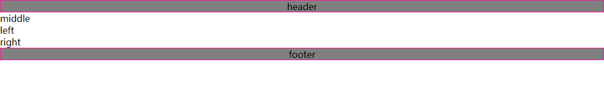

## CSS三列布局之圣杯布局、双飞翼布局

开门见山，实现如下效果：


技术点：

​	浮动：搭建完整的布局框架
​	margin为负值调整旁边两列的位置 使三列布局到一行上
​	使用相对定位：调整调整旁边两列的位置 使旁边两列调整到两头

----

先回退到结构：



html：

```html
<body>
    <div id="header">header</div>
    <div id="content" class="clearfix">
        <div class="middle">middle</div>
        <div class="left">left</div>
        <div class="right">right</div>
    </div>
    <div id="footer">footer</div>
</body>
```

css:

```css
* {
    margin: 0;
    padding: 0;
}

#header, #footer {
    height: 20px;
    text-align: center;
    border: 1px solid deeppink;
    background-color: gray;
}
```


### **接下来处理我们最重要的content部分**

- 把主列放在文档流最前面，使主列优先加载。(即我们的middle div)

- 使用浮动，content使用clearfix清除浮动，加上背景色区分

```css
#content .middle, #content .left, #content .right {
    float: left;
}
.clearfix {
    *zoom: 1;
}
.clearfix:after{
    content: "";
    display: block;
    clear: both;
} 
```


这时middle left right三个div已经同在一行，接着

- 定主列middle宽度为100%
- 左右定200px

```css
#content .middle {
    background-color: #FFFF00;
    width: 100%;
}
#content .left, #content .right {
    background-color: pink;
    width: 200px;
}
```


得到：


现在我们需要left和right和主列同行，而且left在左、right在右。**可以采用margin为负值调整旁边两列的位置**

- left使用margin-left把它的**边界**往左边退对应父级的100%
- right使用margin-left把它的**边界**往左边退一个它自身的宽度

```css
#content .left {
    margin-left: -100%;
}
#content .right {
    margin-left: -200px;
}
```


得到如此状态后，剩下middle 主列内容的显示，**圣杯布局和双飞翼布局**采用了两种不同的做法处理。下面进入正题：

---


### 圣杯布局

- 对**content**盒子使用padding，上下不动，左右一个盒子宽度（即200px）
- **（为什么不对middle使用padding？答：为了撑开元素，middle已经给定了100%的宽度，因此使用padding只会向外扩大盒子。这里给双飞翼布局做个铺垫）**


前端的xy轴，正值向内缩，负值向外扩：

所以

- 使用相对定位使旁边两列调整到两头

```css
#content .left {
    margin-left: -100%;
    position: relative;
    left: -200px;
}
#content .right {
    margin-left: -200px;
    position: relative;
    right: -200px;
}
```


从而完成了我们的三列布局。


### 双飞翼布局

- 上面说到**padding**的问题
- 在middle盒子中内嵌一个盒子，利用内嵌盒子继承了父元素宽度使用padding使得盒子缩短。

```html
<body>
    <div id="header">header</div>
    <div id="content" class="clearfix">
        <div class="middle">
            <div class="m_inner">
                middle
            </div>
        </div>
        <div class="left">left</div>
        <div class="right">right</div>
    </div>
    <div id="footer">footer</div>
</body>
```

```css
#content .middle .m_inner {
    padding: 0 200px;
}
```


从而完成我们的三列布局。


#### 两组实现的对比：

1. 两种布局方式都是把主列放在文档流最前面，使主列优先加载。
2. 两种布局方式在实现上也有相同之处，都是让三列浮动，然后通过负外边距形成三列布局。
3. 两种布局方式的不同之 处在于如何处理中间主列位置：
   - **圣杯布局**是利用父容器的左右内边距+两个从列相对定位；
   - **双飞翼布局**是把主列嵌套在一个新的父级块中 利用主列的左右外边距进行布局调整


下面还有一点

### 伪等高问题

如下面这种情况：


伪等高解决方法：

**利用padding-bottom把盒子撑开，再利用margin-bottom把边距收回来。**

```css
#content .middle, #content .left, #content .right {
    padding-bottom: 10000px;
    margin-bottom: -10000px;
}
```


此时content盒子的下边框是在原来正常位置的，我们再把溢出的内容隐藏就可以啦。

```css
#content {
    overflow: hidden;
}
```


---

### 双飞翼布局完整代码（圣杯就让大家先开始动动手啦）：

```html
<!DOCTYPE html>
<html>
	<head>
		<meta charset="utf-8">
		<title></title>
		<style type="text/css">
			* {
				margin: 0;
				padding: 0;
			}
			body{
				min-width: 600px;
			}
			/* 头部脚步 */
			#header, #footer {
				border: 1px solid;
				background-color: gray;
				text-align: center;
			}
			
			/* 三列伪等高 */
			#content .middle, #content .left, #content .right {
				padding-bottom: 10000px;
				margin-bottom: -10000px;
				height: 50px;
				line-height: 50px;
				float: left;
			}
			#content {
				overflow: hidden;
			}
			
			/* 双飞翼 */
			#content .middle {
				background-color: deeppink;
				width: 100%;
			}
			#content .middle .m_inner {
				padding: 0 200px;
			}
			
			#content .left, #content .right {
				background-color: pink;
				width: 200px;
				text-align: center;
			}
			#content .left {
				margin-left: -100%;
			}
			#content .right {
				margin-left: -200px;
			}
			
			
		</style>
	</head>
	<body>
		<div id="header"><h4>header</h4></div>
		<div id="content">
			<div class="middle">
				<div class="m_inner">
					middle
				</div>
			</div>
			<div class="left">left</div>
			<div class="right">right</div>
		</div>
		<div id="footer"><h4>footer</h4></div>
	</body>
</html>

```

